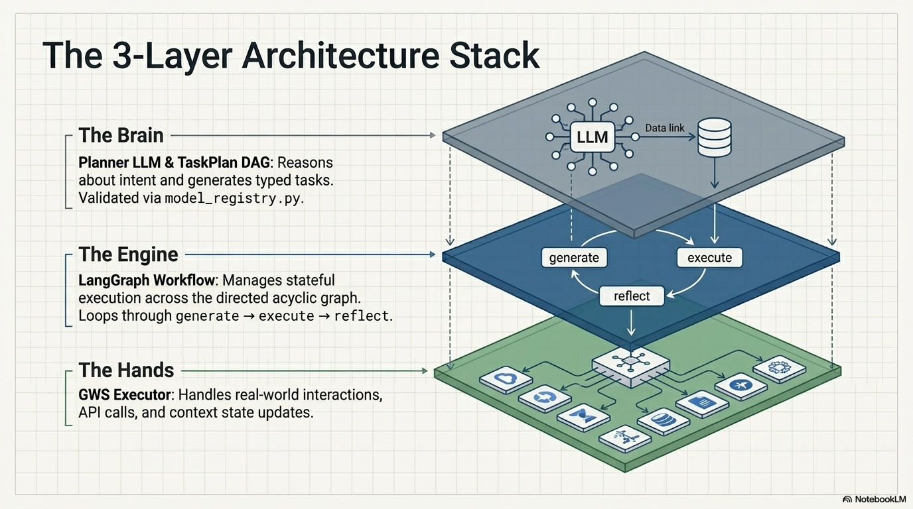
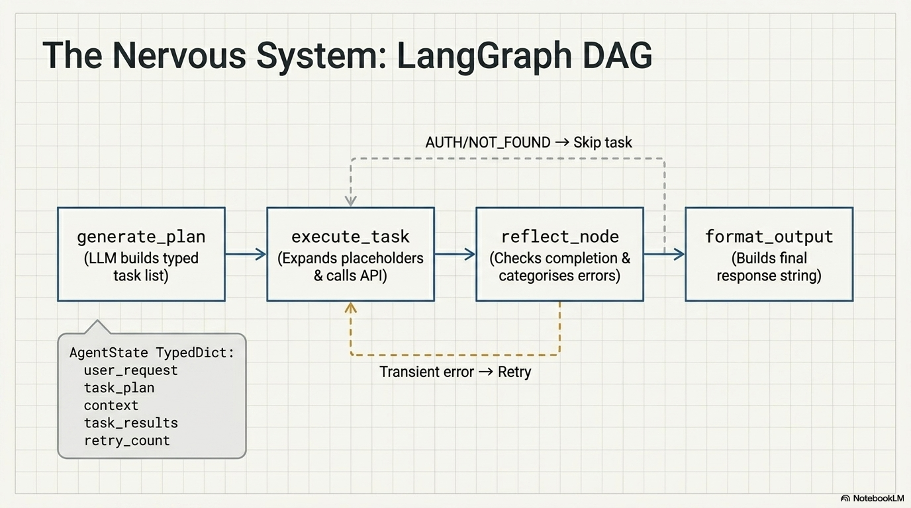
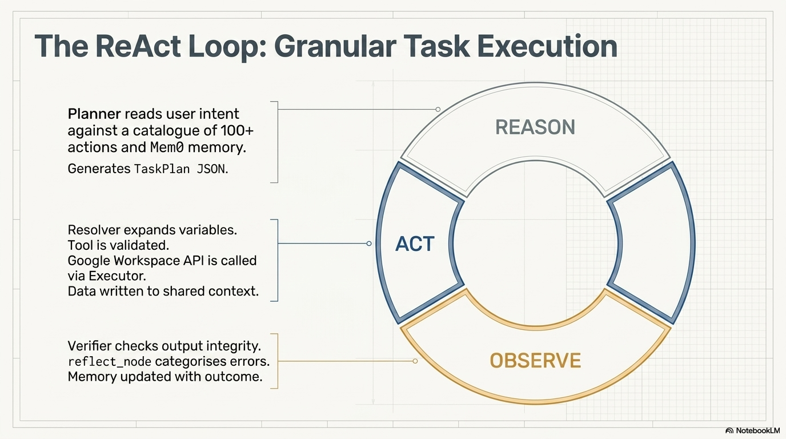
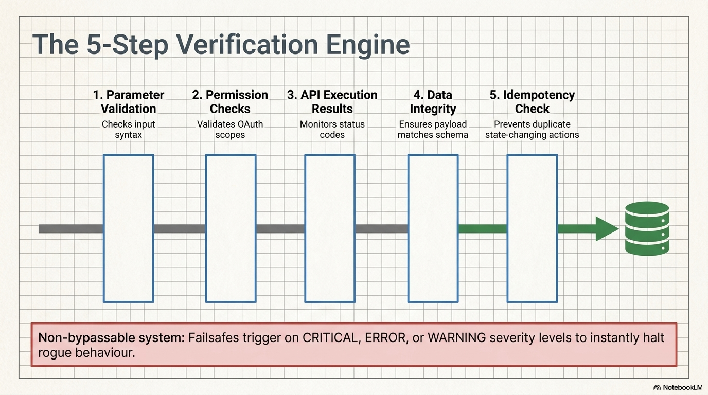
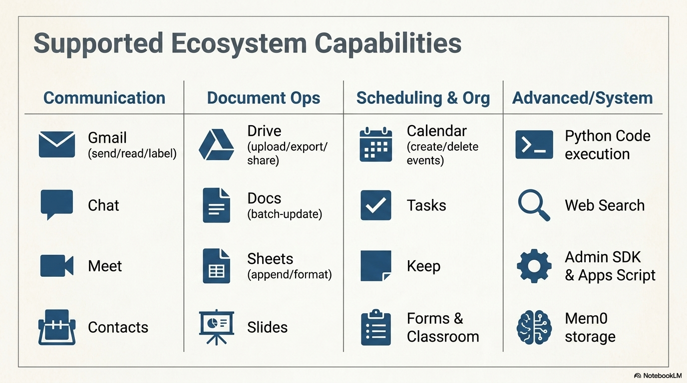
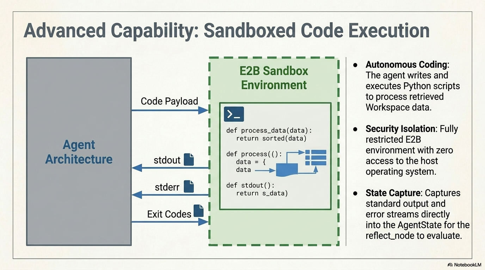
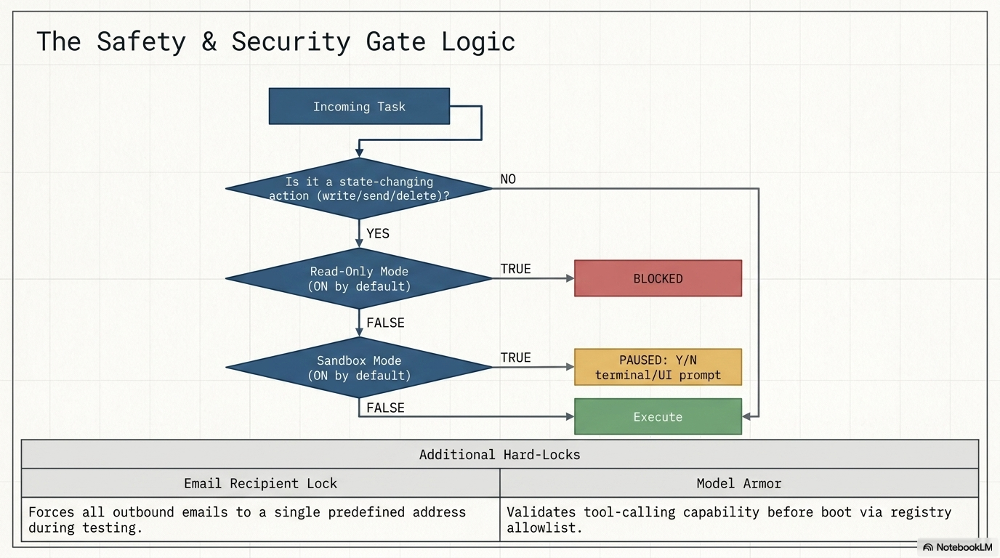
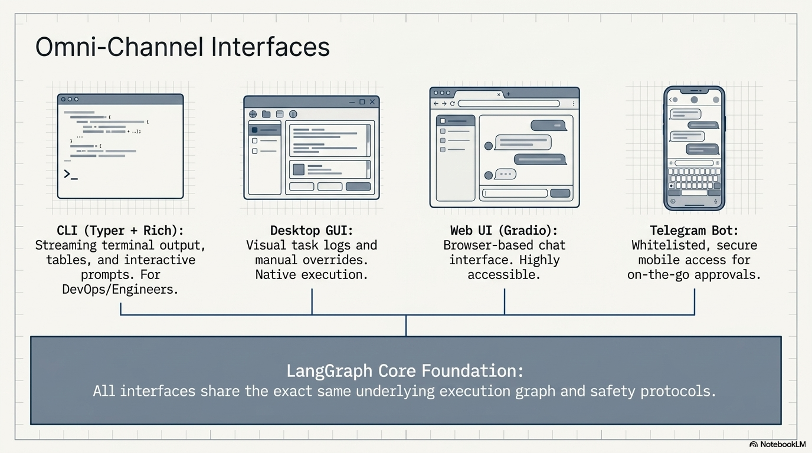
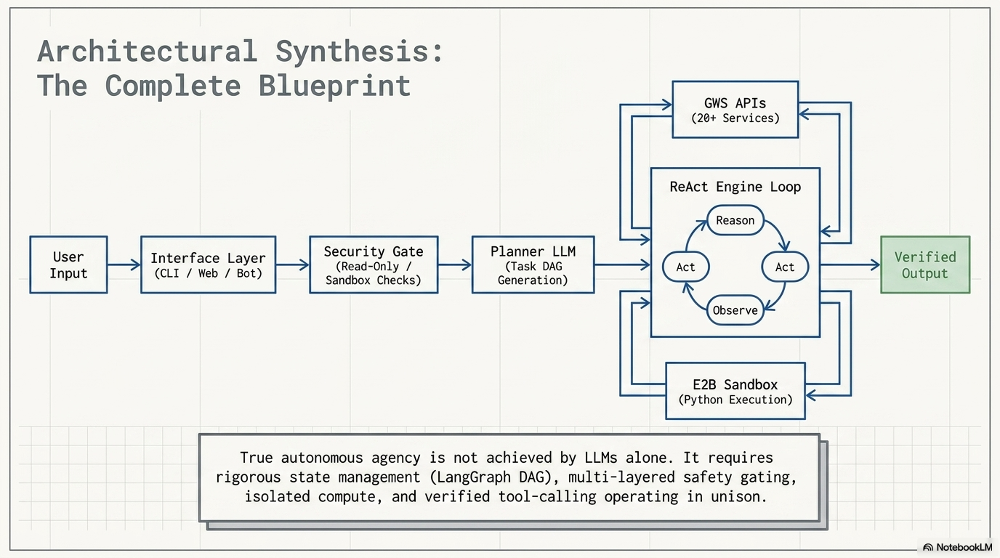
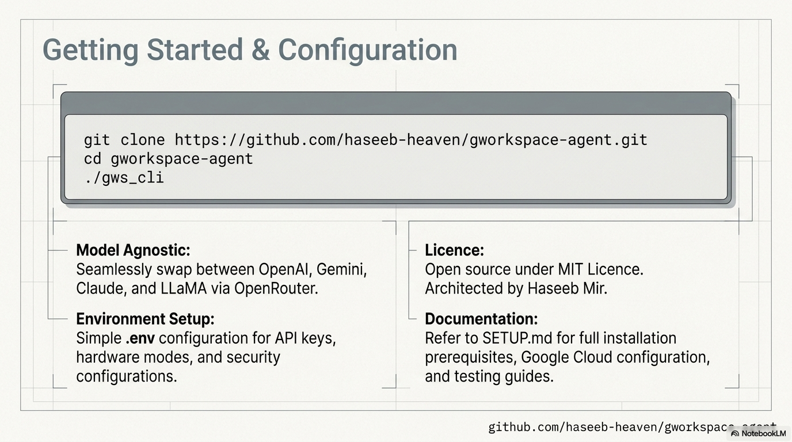

# 📊 Project Presentation Walkthrough

This document provides a detailed overview of the system design, features, and roadmap for the Google Workspace Agent.

  
   <i>Slide 1: Project Introduction</i>  
  
   <i>Slide 2: System Overview</i>  
  
   <i>Slide 3: Core Architecture</i>  
  
   <i>Slide 4: Key Features & Capabilities</i>  
  
   <i>Slide 5: Service Integration</i>  
  
   <i>Slide 6: Security & Safety Protocols</i>  
  
   <i>Slide 7: Execution Workflow</i>  
  
   <i>Slide 8: LangGraph State Machine</i>  
  
   <i>Slide 9: Memory & Context Management</i>  
  
   <i>Slide 10: Multi-Interface Support</i>  
  
   <i>Slide 11: Performance & Reliability</i>  
  
   <i>Slide 12: Roadmap & Future Work</i>  
  
   <i>Slide 13: Summary & Conclusion</i>  

---
[⬅️ Back to README](../README.md) | [📥 Download PPTX](assets/Google_Workspace_Agent.pptx)
