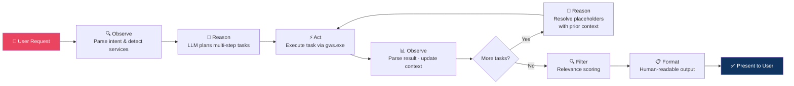

# Google Workspace Agent

An intelligent, agentic CLI and GUI for Google Workspace automation powered by an LLM-driven ReAct planning loop.

The agent uses CrewAI for LLM-based task planning (with a deterministic local fallback), detects multiple Google Workspace services in a single natural-language prompt, plans multi-step execution, runs the matching `gws` commands, applies relevance filtering, and formats results for humans instead of dumping raw JSON.

## Architecture


### How the Agentic Loop Works

The agent follows a **ReAct (Reasoning + Acting)** pattern — a loop where the system reasons about what to do, acts on it, observes the result, and uses that observation to inform the next step:



#### Step-by-Step Flow

| Step | Component | What Happens |
|------|-----------|--------------|
| 1 | **Intent Parser** | Detects which Google services (Gmail, Drive, Sheets, etc.) are mentioned in the user's request |
| 2 | **LLM Planner** | CrewAI agent decomposes the request into an ordered list of tasks with parameters and `$placeholder` variables |
| 3 | **Task Expander** | Resolves `$placeholders` (e.g., `$last_spreadsheet_id` → actual ID from step 2's output) and expands batch operations (e.g., one `get_message` → five individual API calls) |
| 4 | **GWS Runner** | Executes each command as a subprocess call to `gws.exe` with proper argument encoding |
| 5 | **Context Store** | After each task, extracts key data (spreadsheet IDs, message IDs, URLs) and stores them for downstream tasks |
| 6 | **Relevance Filter** | Scores each result against the user's original query keywords; drops items below the relevance threshold |
| 7 | **Output Formatter** | Converts raw API payloads into clean tables, summaries, and human-readable text |

### Supported Placeholders

| Placeholder | Used In | Resolved To |
|------------|---------|-------------|
| `$last_spreadsheet_id` | `sheets.append_values` | ID of the most recently created spreadsheet |
| `$gmail_message_ids` | `gmail.get_message` | Expands to individual message IDs from the search |
| `$gmail_summary_values` | `sheets.append_values` | 2D array of Gmail message data (From, Subject, etc.) |
| `$drive_summary_values` | `sheets.append_values` | 2D array of Drive file data (Name, Type, Link) |
| `$sheet_email_body` | `gmail.send_message` | Formatted text from spreadsheet values |

## Supported Services

| Service | Actions |
|---------|---------|
| Gmail | `list_messages`, `get_message`, `send_message` |
| Google Drive | `list_files`, `create_folder`, `get_file`, `delete_file` |
| Google Sheets | `create_spreadsheet`, `get_spreadsheet`, `get_values`, `append_values` |
| Google Calendar | `list_events`, `create_event` |
| Google Docs | `get_document` |
| Google Slides | `get_presentation` |
| Google Contacts | `list_contacts` |

## Setup

Install dependencies:

```bash
python -m venv .venv
.venv\Scripts\activate
pip install -r requirements.txt
```

Run setup explicitly:

```bash
python cli.py --setup
```

Setup mode:

- Detects a local, npm/global, or PATH-provided `gws` binary.
- Saves the resolved `GWS_BINARY_PATH`.
- Saves OpenAI or OpenRouter model settings.
- Saves API keys if provided.
- Writes `.env`.

Setup is never triggered automatically. Normal app startup expects setup to already be complete.

## Run

Default CLI:

```bash
python cli.py
```

Backward-compatible launcher:

```bash
python gws_cli.py
```

GUI:

```bash
python gws_gui.py
```

Browser GUI (Gradio):

```bash
python gws_gradio.py --host 127.0.0.1 --port 7860
```

Optional output capture:

```bash
python cli.py --save-output outputs/session.txt
```

## Example Requests

**Simple search:**
```text
>: List all emails from boss@company.com
```

**Multi-service workflow:**
```text
>: Search Google Documents for "Agentic AI - Builders" and create a Sheet
   from the results, then send email to user@example.com with the sheet link
```

The assistant plans this as:

1. Search Drive for documents matching "Agentic AI - Builders" (with query filter).
2. Create a Google Sheet titled "Agentic AI Builders Data".
3. Append the filtered Drive results into the sheet.
4. Send an email with the sheet link automatically injected.

If no Workspace service is detected, it returns:

```text
No Google Workspace service detected in your request.
```

## Project Structure

```text
.
|-- cli.py                    # Main CLI entry point
|-- gws_cli.py                # Backward-compatible launcher
|-- gws_gui.py                # Tkinter GUI launcher
|-- gws_gradio.py             # Gradio web UI launcher
|-- requirements.txt
|-- src/
|   `-- gws_assistant/
|       |-- agent_system.py   # LLM + heuristic planning (ReAct loop)
|       |-- cli_app.py        # Terminal UI with Rich
|       |-- config.py         # Environment configuration
|       |-- conversation.py   # Orchestration between parsing, planning, execution
|       |-- execution.py      # Task expansion, placeholder resolution, context
|       |-- gradio_app.py     # Gradio web interface
|       |-- gws_runner.py     # Subprocess runner for gws.exe
|       |-- output_formatter.py # Human-readable output tables & summaries
|       |-- planner.py        # Command argument construction
|       |-- relevance.py      # Post-retrieval relevance scoring & filtering
|       |-- service_catalog.py # Service/action definitions & parameter specs
|       `-- setup_wizard.py   # Interactive setup configuration
`-- tests/
```

## Logs

Logs go to both console and `logs/gws_assistant.log` with rotation. The app logs setup state, agent planning decisions, actions, command execution, and errors.

## Tests

```bash
python -m pytest
```
