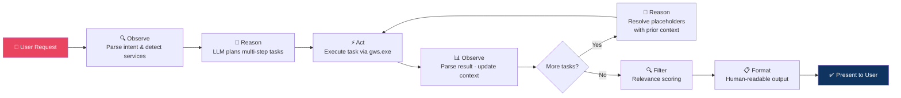
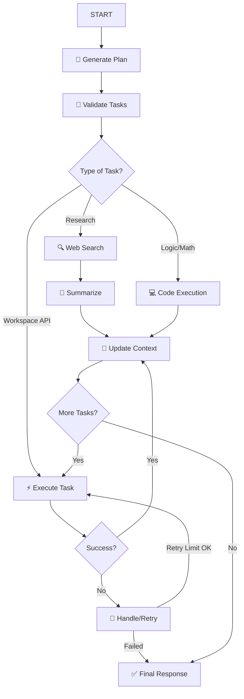

# Google Workspace Agent

An intelligent, agentic CLI and GUI for Google Workspace automation with a shared execution contract (typed state, structured tool results, reflection-aware retries).

> 🔀 **Repository branch roles:**
> - [`master`](https://github.com/haseeb-heaven/gworkspace-agent/tree/master) — core generic ReAct engine
> - [`langchain-ai`](https://github.com/haseeb-heaven/gworkspace-agent/tree/langchain-ai) — deterministic generic research pipeline
> - [`crew-ai`](https://github.com/haseeb-heaven/gworkspace-agent/tree/crew-ai) — generic multi-step computation-first tool agent

---

## Why Three Branches?

| Feature | [`crew-ai`](https://github.com/haseeb-heaven/gworkspace-agent/tree/crew-ai) | [`langchain-ai`](https://github.com/haseeb-heaven/gworkspace-agent/tree/langchain-ai) |
|---------|----------|--------------|
| LLM Framework | CrewAI | LangChain + LangGraph |
| Orchestration | ReAct loop (sequential task planner) | LangGraph StateGraph (DAG-based) |
| Internet Web Search | ❌ | ✅ DuckDuckGo / Tavily |
| Sandboxed Code Execution | ❌ | ✅ RestrictedPython sandbox |
| Workspace Automation | ✅ Full | ✅ Full + Google Meet & Chat |
| Heuristic Fallback (no API key) | ✅ | ✅ |
| Retry / Exponential Backoff | ❌ | ✅ |
| Best For | Fast, reliable Workspace-only tasks | Complex research + compute + Workspace workflows |

---

## Architecture


### ReAct Agentic Loop (Both Branches)

The agent follows the **ReAct (Reasoning + Acting)** pattern — a continuous loop where the system **reasons** about what to do next, **acts** on it by calling a tool or API, **observes** the result, and uses that observation to guide the next step. This loop repeats until the entire user request is resolved.



#### ReAct Loop — Step-by-Step

| Step | Component | What Happens |
|------|-----------|--------------|
| 1 | **Intent Parser** | Detects which Google services (Gmail, Drive, Sheets, etc.) are mentioned |
| 2 | **LLM Planner** | CrewAI or LangChain agent decomposes the request into an ordered list of tasks with parameters and `$placeholder` variables |
| 3 | **Task Expander** | Resolves `$placeholders` (e.g., `$last_spreadsheet_id` → actual ID from prior step) and expands batch operations |
| 4 | **GWS Runner** | Executes each command as a subprocess call to `gws.exe` with proper argument encoding |
| 5 | **Context Store** | After each task, extracts key IDs, URLs, and values; stores them for downstream tasks |
| 6 | **Relevance Filter** | Scores each result against original query keywords; drops items below relevance threshold |
| 7 | **Output Formatter** | Converts raw API payloads into clean tables, summaries, and human-readable text |

---

### LangGraph State Machine (`langchain-ai` branch only)

In the `langchain-ai` branch, the ReAct loop is backed by a **LangGraph directed acyclic graph (DAG)** — enabling conditional branching between three task types (web search, code execution, Workspace API) and robust error recovery with retries.



---

## Key Features

### Core (Both Branches)
- **Dual Framework Support** — Choose CrewAI (crew-ai branch) or LangChain + LangGraph (langchain-ai branch) depending on task complexity.
- **ReAct Agentic Planning** — The LLM reasons, acts, observes, and iterates step-by-step until the full request is resolved.
- **Multi-Service Detection** — Detects multiple Google Workspace services in a single natural-language prompt and plans cross-service workflows automatically.
- **Placeholder Resolution** — Dynamically resolves `$placeholders` across steps (e.g., inject a freshly created spreadsheet ID into the next step's email body).
- **Dual Planning Modes** — High-precision LLM reasoning with a zero-API-key deterministic heuristic fallback.
- **Human-Readable Output** — Formats all API payloads into clean tables and summaries instead of raw JSON.
- **Structured Logging** — Logs to both console and rotating `logs/gws_assistant.log` file; includes agent decisions, commands, and errors.

### LangChain + LangGraph Branch (`langchain-ai`) — Exclusive Features
- **🌐 Internet Web Search** — Built-in DuckDuckGo and Tavily search with LLM-powered summarization for real-time data enrichment during task planning.
- **💻 Sandboxed Code Execution** — Safely runs Python logic, calculations, and data transformations inside a `RestrictedPython` environment; no unsafe system access.
- **🔄 Exponential Backoff & Retry** — Robust reliability layer that retries failed Workspace API calls with increasing delays against rate limits and transient errors.
- **Google Meet & Google Chat** — Extended Workspace service support beyond the base set.
- **LangGraph DAG Orchestration** — Conditional routing between Research, Code, and Workspace API task types in a stateful graph.

---

## Supported Placeholders

| Placeholder | Used In | Resolved To |
|------------|---------|-------------|
| `$last_spreadsheet_id` | `sheets.append_values` | ID of the most recently created spreadsheet |
| `$gmail_message_ids` | `gmail.get_message` | Expands to individual message IDs from the search |
| `$gmail_summary_values` | `sheets.append_values` | 2D array of Gmail message data (From, Subject, etc.) |
| `$drive_summary_values` | `sheets.append_values` | 2D array of Drive file data (Name, Type, Link) |
| `$sheet_email_body` | `gmail.send_message` | Formatted text from spreadsheet values |

---

## Supported Services

| Service | Actions | crew-ai | langchain-ai |
|---------|---------|---------|--------------|
| Gmail | `list_messages`, `get_message`, `send_message` | ✅ | ✅ |
| Google Drive | `list_files`, `create_folder`, `get_file`, `delete_file` | ✅ | ✅ |
| Google Sheets | `create_spreadsheet`, `get_spreadsheet`, `get_values`, `append_values` | ✅ | ✅ |
| Google Calendar | `list_events`, `create_event` | ✅ | ✅ |
| Google Docs | `get_document` | ✅ | ✅ |
| Google Slides | `get_presentation` | ✅ | ✅ |
| Google Contacts | `list_contacts` | ✅ | ✅ |
| Google Meet | — | ❌ | ✅ |
| Google Chat | — | ❌ | ✅ |

---

## Setup

1. Install dependencies:

```powershell
python -m pip install -r requirements.txt
```

2. Create your env file if needed:

```powershell
Copy-Item .env.example .env
```

3. Run the interactive setup wizard:

```powershell
python .\gws_cli.py --setup
```

The preferred launcher on this branch is `gws_cli.py`. `cli.py` is kept as a compatibility shim.

## Environment Variables

Required or commonly used keys:

- `LLM_PROVIDER`, `OPENAI_API_KEY`, `OPENAI_MODEL`
- `OPENROUTER_API_KEY`, `OPENROUTER_MODEL`, `OPENROUTER_BASE_URL`
- `GWS_BINARY_PATH`
- `LANGCHAIN_ENABLED`
- `TAVILY_API_KEY` for higher-quality search fallback
- `CODE_EXECUTION_ENABLED`
- `CODE_EXECUTION_BACKEND` with `restricted_subprocess`, `docker`, or `e2b`
- `E2B_API_KEY` when `CODE_EXECUTION_BACKEND=e2b`
- `DEFAULT_RECIPIENT_EMAIL` for email workflows when the prompt omits a recipient

See `.env.example` for the full template.

## Usage

Run a single task:

```powershell
python .\gws_cli.py --task "List my unread Gmail messages about invoices and save them to a new Google Sheet"
```

Force heuristic mode:

```powershell
python .\gws_cli.py --no-langchain --task "Search Drive for quarterly planning docs"
```

Launch Gradio:

```powershell
python .\gws_gradio.py
```

## Example Workflows

Research + Docs + Sheets + Gmail:

```text
No Google Workspace service detected in your request.
```

---

## Project Structure

```text
.
├── cli.py                    # Main CLI entry point
├── gws_cli.py                # Backward-compatible launcher
├── gws_gui.py                # Tkinter GUI launcher
├── gws_gradio.py             # Gradio web UI launcher
├── requirements.txt
└── src/
    └── gws_assistant/
        ├── agent_system.py        # LLM + heuristic planning (ReAct loop core)
        ├── cli_app.py             # Terminal UI with Rich
        ├── config.py              # Environment configuration
        ├── conversation.py        # Orchestration: parsing → planning → execution
        ├── execution.py           # Task expansion, placeholder resolution, context store
        ├── gradio_app.py          # Gradio web interface
        ├── gws_runner.py          # Subprocess runner for gws.exe
        ├── output_formatter.py    # Human-readable output (tables, summaries)
        ├── planner.py             # Command argument construction
        ├── relevance.py           # Post-retrieval relevance scoring & filtering
        ├── service_catalog.py     # Service/action definitions & parameter specs
        ├── setup_wizard.py        # Interactive setup configuration
        │
        │   ── langchain-ai branch only ──
        ├── langchain_agent.py     # LangChain-powered planning engine
        ├── langgraph_workflow.py  # LangGraph StateGraph DAG orchestration
        └── tools/
            ├── web_search.py      # DuckDuckGo / Tavily integration
            └── code_executor.py   # RestrictedPython sandbox
└── tests/
```

---

## Logs

Logs go to both console and `logs/gws_assistant.log` with automatic rotation. The app logs:
- Setup state and binary detection
- Agent planning decisions and LLM reasoning traces
- Actions taken and commands executed
- Context store updates (IDs, URLs, values passed between steps)
- Errors and retry attempts

---

## Tests

```bash
python -m pytest
```

---

## Branches

| Branch | Framework | Extra Capabilities | Link |
|--------|-----------|-------------------|------|
| `master` | CrewAI (base) | Core ReAct Workspace automation | [master](https://github.com/haseeb-heaven/gworkspace-agent/tree/master) |
| `crew-ai` | CrewAI | Full ReAct loop, multi-service | [crew-ai](https://github.com/haseeb-heaven/gworkspace-agent/tree/crew-ai) |
| `langchain-ai` | LangChain + LangGraph | Web Search + Code Sandbox| [langchain-ai](https://github.com/haseeb-heaven/gworkspace-agent/tree/langchain-ai) |

---

## Changelogs
For changelogs check [CHANGELOG](https://github.com/haseeb-heaven/gworkspace-agent/CHANGELOG.md)

## License

This project is licensed under the **MIT License**.

## Author
This project is created and maintained by [Haseeb-Heaven](www.github.com/haseeb-heaven).
