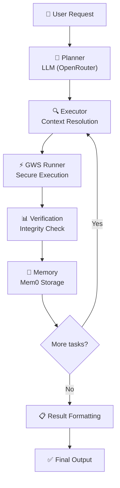

# 🚀 Google Workspace Agent

[](https://www.python.org/)
[](https://opensource.org/licenses/MIT)
[](https://langchain-ai.github.io/langgraph/)
[](#-safety--security)

An intelligent, autonomous AI agent designed to revolutionize your Google Workspace productivity. Built on a hybrid **LangChain + LangGraph** architecture, it transforms natural language requests into complex, multi-step workflows across the entire Google ecosystem.

---

## 🌟 Key Features

*   **🧠 ReAct Agentic Loop**: Sophisticated planning and execution using LLMs (via OpenRouter) with heuristic fallbacks.
*   **🛠️ Multi-Service Integration**: Seamlessly orchestrates Gmail, Drive, Sheets, Docs, Calendar, and more in a single task.
*   **🛡️ Safety First**: Built-in **Read-Only** and **Interactive Sandbox** modes to protect your data.
*   **💾 Long-Term Memory**: Powered by **Mem0**, the agent learns from past interactions to improve future performance.
*   **💻 Code Execution**: Securely runs Python code in a restricted sandbox for data processing, math, and logic.
*   **📱 Multi-Interface**: Access your agent via **CLI**, **Desktop GUI**, **Web Interface**, or **Telegram Bot**.

---

## 🛡️ Safety & Security

The agent is designed with a **Safety-by-Default** philosophy. It intercepts operations that could modify or delete your data unless explicitly permitted.

### 🔒 Read-Only Mode (Default)
Blocks all write, create, update, append, send, and delete actions.
*   **To enable writes:** Run with `--read-write` or set `READ_ONLY_MODE=false` in `.env`.

### 🧪 Sandbox Mode (Default)
When writes are allowed, Sandbox mode intercepts state-changing actions and requires manual confirmation `(Y/N)` before execution.
*   **To disable:** Run with `--no-sandbox` or set `SANDBOX_ENABLED=false` in `.env`.

---

## 🚀 Getting Started

### 📦 Installation

1. **Clone the repository:**
   ```bash
   git clone https://github.com/haseeb-heaven/gworkspace-agent.git
   cd gworkspace-agent
   ```

2. **Set up Python environment:**
   ```bash
   # Use the recommended environment path
   D:\henv\Scripts\activate
   pip install -r requirements.txt
   ```

3. **Configuration:**
   👉 **[Follow the SETUP.md Guide](./SETUP.md)** to configure your Google Cloud credentials and `.env` file.

---

## 🕹️ Multi-Interface Experience

Choose the interface that fits your workflow:

| Interface | Command | Description |
| :--- | :--- | :--- |
| **💻 CLI** | `python gws_cli.py` | Rich terminal UI with streaming, tables, and interactive prompts. |
| **🖥️ Desktop GUI** | `python gws_gui.py` | Native `CustomTkinter` app for manual control and visual logs. |
| **🌐 Web GUI** | `python gws_gui_web.py` | Modern `Gradio` chat interface for browser-based interaction. |
| **🤖 Telegram** | `python gws_telegram.py` | Secure mobile access via a whitelisted Telegram Bot. |

### 🎬 Video Demos

*Check out our **[Video Recording Guide](./docs/VIDEO_DEMO_GUIDE.md)** to see the agent in action.*

---

## 🧩 Supported Services

The agent can orchestrate over **20+ services** and **100+ actions**:

| | | | |
| :---: | :---: | :---: | :---: |
| 📧 **Gmail** | 📂 **Drive** | 📊 **Sheets** | 📝 **Docs** |
| 📅 **Calendar** | 📽️ **Slides** | 👥 **Contacts** | 💬 **Chat** |
| 📹 **Meet** | 🗒️ **Keep** | 📋 **Tasks** | 🏫 **Classroom** |
| 📜 **Scripts** | 📝 **Forms** | 🔍 **Web Search** | 🛡️ **Admin SDK** |
| 🐍 **Python Sandbox** | 🧠 **Memory** | 🔔 **Notifications** | 🛡️ **Model Armor** |

---

## ⚙️ Architecture

The agent follows a sophisticated **ReAct (Reason + Act)** loop, ensuring every action is planned, executed, and verified.



### Tech Stack
*   **Orchestration**: LangGraph, LangChain
*   **LLM Provider**: OpenRouter (Gemini, GPT, Claude)
*   **Memory**: Mem0, JSONL
*   **UI/UX**: Rich (CLI), CustomTkinter (Desktop), Gradio (Web), Telegram Bot API
*   **Safety**: RestrictedPython, Custom Security Guards

---

## 📂 Project Structure

```text
gworkspace-agent/
├── gws_assistant/          # Core logic and agent system
│   ├── execution/          # Action execution engines
│   ├── tools/              # Service-specific tool implementations
│   ├── agent_system.py     # Main agent coordinator
│   ├── planner.py          # LLM-based task planning
│   └── service_catalog.py  # Definitions of all GWS actions
├── scripts/                # Essential automation scripts
├── tests/                  # Comprehensive test suite
├── assets/                 # Screenshots and demo assets
├── gws_cli.py              # CLI Entry point
├── gws_gui.py              # Desktop GUI Entry point
├── gws_gui_web.py          # Web GUI Entry point
└── gws_telegram.py         # Telegram Bot Entry point
```

---

## 🧪 Testing

Ensure everything is running smoothly with our robust test suite:

```bash
# Run all unit tests
python -m pytest

# Run integration tests (requires credentials)
python -m pytest -m "not skip_integration"
```

---

## 📜 License

Distributed under the **MIT License**. See `LICENSE` for more information.

---

<p align="center">
  Built with ❤️ for the AI community by Haseeb Mir
</p>
