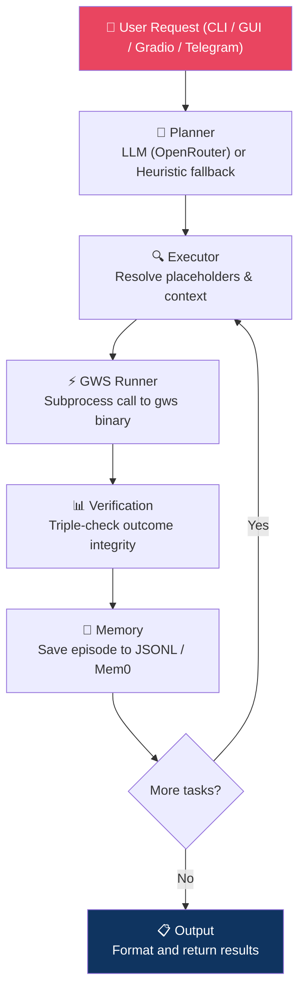

# Google Workspace Agent

An intelligent, agentic CLI and GUI for Google Workspace automation powered by a hybrid **LangChain + LangGraph** architecture. Transforms natural language requests into complex, multi-step workflows across Gmail, Drive, Sheets, Docs, Calendar, and more — with ReAct planning, sandboxed code execution, and long-term memory.

> 🔀 **Branch roles:**
> - [`master`](https://github.com/haseeb-heaven/gworkspace-agent/tree/master) — core generic ReAct engine (base)
> - [`crew-ai`](https://github.com/haseeb-heaven/gworkspace-agent/tree/crew-ai) — CrewAI-powered multi-step Workspace automation
> - [`langchain-ai`](https://github.com/haseeb-heaven/gworkspace-agent/tree/langchain-ai) — LangChain + LangGraph research + compute + Workspace pipeline
> - [`develop`](https://github.com/haseeb-heaven/gworkspace-agent/tree/develop) — active development branch (latest features)

---

## Table of Contents

- [Prerequisites](#prerequisites)
- [Installation](#installation)
- [Configuration](#configuration)
- [Quick Start](#quick-start)
- [Interfaces](#interfaces)
  - [CLI — Terminal Interface](#1-cli--terminal-interface)
  - [Desktop GUI — CustomTkinter](#2-desktop-gui--customtkinter)
  - [Gradio — Browser Web UI](#3-gradio--browser-web-ui)
  - [Telegram Bot](#4-telegram-bot)
- [Running Tests](#running-tests)
- [Example Workflows](#example-workflows)
- [Project Structure](#project-structure)
- [Architecture](#architecture)
- [Supported Services](#supported-services)
- [Troubleshooting](#troubleshooting)
- [Branch Comparison](#branch-comparison)

---

## Prerequisites

Before you begin, ensure you have the following installed and available:

| Requirement | Version | Notes |
|---|---|---|
| **Python** | `>= 3.10` | `3.11` recommended |
| **gws CLI** | Latest | [Google Workspace CLI](https://github.com/googleworkspace/cli) — must be on `PATH` or configured via `GWS_BINARY_PATH` |
| **OpenRouter API Key** | — | Free tier available at [openrouter.ai](https://openrouter.ai). Required for LLM planning. |
| **Tavily API Key** | Optional | For enhanced web search. Falls back to DuckDuckGo if not set. |
| **Telegram Bot Token** | Optional | Only required if using the Telegram interface. |
| **E2B API Key** | Optional | Only required if using `CODE_EXECUTION_BACKEND=e2b`. |

> ℹ️ The agent works without an API key using the built-in **heuristic fallback** planner — but LLM-based planning is strongly recommended for complex multi-step tasks.

---

## Installation

### 1. Clone the repository

```bash
git clone https://github.com/haseeb-heaven/gworkspace-agent.git
cd gworkspace-agent
git checkout develop
```

### 2. Create and activate a virtual environment

```bash
# Windows
python -m venv .venv
.venv\Scripts\activate

# macOS / Linux
python -m venv .venv
source .venv/bin/activate
```

### 3. Install the package and dependencies

```bash
pip install -e .
```

To also install development/test dependencies:

```bash
pip install -e ".[dev]"
```

Or using `requirements.txt` if available:

```bash
pip install -r requirements.txt
```

### 4. Copy the environment template

```bash
# Windows
copy .env.example .env

# macOS / Linux
cp .env.example .env
```

### 5. Run the interactive setup wizard

This is the **easiest and recommended** way to configure the agent. It walks you through all required settings and writes your `.env` file automatically.

```bash
python gws_cli.py --setup
```

The wizard will:
- Detect or ask for the path to the `gws` binary
- Ask for your OpenRouter API key and model
- Ask for optional keys (Tavily, Telegram, E2B)
- Save everything to `.env`

---

## Configuration

All configuration is controlled via the `.env` file. The most important variables are:

### Core Settings

| Variable | Required | Default | Description |
|---|---|---|---|
| `OPENROUTER_API_KEY` | ✅ Yes | — | Your OpenRouter API key for LLM planning |
| `OPENROUTER_MODEL` | ✅ Yes | `openrouter/free` | Model to use (e.g. `nvidia/nemotron-super-49b-v1:free`) |
| `OPENROUTER_BASE_URL` | ✅ Yes | `https://openrouter.ai/api/v1` | OpenRouter endpoint |
| `GWS_BINARY_PATH` | ✅ Yes | `gws` | Full path to the `gws` CLI binary |
| `LANGCHAIN_ENABLED` | No | `true` | Set to `false` to use heuristic-only planning |

### Optional Settings

| Variable | Default | Description |
|---|---|---|
| `TAVILY_API_KEY` | — | Enhanced web search via Tavily (falls back to DuckDuckGo) |
| `DEFAULT_RECIPIENT_EMAIL` | — | Fallback email recipient when not specified in the prompt |
| `CODE_EXECUTION_ENABLED` | `true` | Enable or disable sandboxed Python code execution |
| `CODE_EXECUTION_BACKEND` | `local` | `local`, `restricted_subprocess`, `docker`, or `e2b` |
| `E2B_API_KEY` | — | Required only when `CODE_EXECUTION_BACKEND=e2b` |
| `MAX_RETRIES` | `3` | Number of retries for failed Workspace API calls |
| `LLM_TIMEOUT_SECONDS` | `30` | Timeout for LLM API calls in seconds |
| `LOG_LEVEL` | `INFO` | Logging verbosity: `DEBUG`, `INFO`, `WARNING`, `ERROR` |
| `LOG_FILE_PATH` | `logs/gws_assistant.log` | Path to the rotating log file |

### Telegram Settings (Bot interface only)

| Variable | Description |
|---|---|
| `TELEGRAM_BOT_TOKEN` | Bot token from [@BotFather](https://t.me/botfather) |
| `TELEGRAM_CHAT_ID` | Your Telegram chat ID (whitelist — bot rejects all others) |

See `.env.example` for the complete template with all available variables.

---

## Quick Start

### Setup in 3 steps

```bash
# 1. Install
pip install -e .

# 2. Run setup wizard
python gws_cli.py --setup

# 3. Run your first task
python gws_cli.py --task "List my 5 most recent Gmail messages"
```

---

## Interfaces

The agent supports four interfaces. All of them read from the same `.env` configuration.

---

### 1. CLI — Terminal Interface

The primary interface. Rich terminal UI with interactive prompts, formatted output tables, and real-time streaming.

#### Launch (interactive mode)

```bash
python gws_cli.py
```

#### Launch (single task mode)

```bash
python gws_cli.py --task "Search Drive for all .qvm files, count them, build a table, and email it to me"
```

#### Launch (heuristic mode — no API key required)

```bash
python gws_cli.py --no-langchain --task "List my Drive files and save them to a new Sheet"
```

#### Available flags

| Flag | Description |
|---|---|
| `--task "..."` | Run a single task and exit |
| `--setup` | Run the interactive setup wizard |
| `--no-langchain` | Disable LLM — use heuristic planner only |
| `--save-output FILE` | Append all output to a file |

#### Example session

```
$ python gws_cli.py

╭─────────────────────────────────────────────────────────╮
│         Google Workspace Assistant — Ready               │
╰─────────────────────────────────────────────────────────╯

You: List my unread emails about invoices and save them to a Google Sheet

Agent:
  [1] gmail.list_messages   → Searching for unread invoice emails...
  [2] sheets.create         → Creating new spreadsheet...
  [3] sheets.append_values  → Writing 7 rows to sheet...

✅ Done. Sheet: https://docs.google.com/spreadsheets/d/...
```

---

### 2. Desktop GUI — CustomTkinter

A native desktop application with a point-and-click interface. Useful for users who prefer visual interaction.

#### Launch

```bash
python gws_gui.py
```

Or using the installed entry point:

```bash
gws-assistant-gui
```

#### What it looks like

- Text box to enter natural language requests
- Service and action dropdowns for manual selection
- Analyze and Execute buttons
- Output panel with formatted results

> ℹ️ Requires a display environment. Will not work over SSH without X forwarding or a virtual display.

---

### 3. Gradio — Browser Web UI

A browser-based chat UI. Ideal for demos, remote access, and sharing with non-technical users.

#### Launch (local)

```bash
python gws_gradio.py
```

Then open: [http://localhost:7860](http://localhost:7860)

#### Launch (custom host/port)

```bash
python gws_gradio.py --host 0.0.0.0 --port 8080
```

#### Launch (public share link via Gradio tunnel)

```bash
python gws_gradio.py --share
```

#### Or using the installed entry point

```bash
gws-assistant-gradio
```

#### Run with Docker

```bash
docker build -t gws-agent .
docker run -p 8080:8080 \
  -e OPENROUTER_API_KEY=your_key \
  -e OPENROUTER_MODEL=openrouter/free \
  -e GWS_BINARY_PATH=/usr/local/bin/gws \
  gws-agent
```

Then open: [http://localhost:8080](http://localhost:8080)

#### Example

```
Browser → http://localhost:7860

Input:  "Find all Drive files with .qvm extension and email me a count summary"

Output: ✅ Found 42 .qvm files across your Drive.
        Summary table emailed to haseebmir.hm@gmail.com.
```

---

### 4. Telegram Bot

A secure Telegram bot interface. Only responds to a whitelisted Chat ID set in `.env`.

#### Prerequisites

1. Create a bot via [@BotFather](https://t.me/botfather) and copy the token.
2. Get your Chat ID (send `/start` to [@userinfobot](https://t.me/userinfobot)).
3. Add to `.env`:

```env
TELEGRAM_BOT_TOKEN=your_bot_token_here
TELEGRAM_CHAT_ID=your_chat_id_here
```

#### Launch

```bash
python -m gws_assistant.telegram_app
```

#### Available Telegram commands

| Command | Description |
|---|---|
| `/start` | Show welcome message |
| `/help` | Show available commands |
| `/mail <task>` | Run a Gmail task |
| `/docs <task>` | Run a Google Docs task |
| `/sheet <task>` | Run a Google Sheets task |
| `/calendar <task>` | Run a Calendar task |
| `/notes <task>` | Run a Google Keep task |

Or just send any natural language message directly to the bot.

#### Example

```
You → Bot:  /mail Show my 5 most recent emails

Bot → You:  📬 Found 5 messages:
            1. Subject: Invoice #1042 | From: billing@acme.com
            2. Subject: Team standup | From: manager@co.com
            ...
```

> ⚠️ The bot rejects all messages from chat IDs that do not match `TELEGRAM_CHAT_ID`. If `TELEGRAM_CHAT_ID` is not set, the bot blocks all messages by default.

---

## Running Tests

### Default test run

```bash
python -m pytest
```

### Understanding pytest markers

This repo uses **service markers** to categorize tests. The default `pytest.ini` filter only runs tests marked with specific service markers:

```
not manual and not live_integration and (gmail or docs or sheets or drive or calendar or tasks or keep)
```

This means **unmarked tests will be deselected** by default. All tests must have at least one service marker to run under the default filter.

### Available markers

| Marker | Meaning |
|---|---|
| `@pytest.mark.gmail` | Gmail-related tests |
| `@pytest.mark.drive` | Google Drive-related tests |
| `@pytest.mark.sheets` | Google Sheets-related tests |
| `@pytest.mark.docs` | Google Docs-related tests |
| `@pytest.mark.calendar` | Calendar-related tests |
| `@pytest.mark.tasks` | Google Tasks-related tests |
| `@pytest.mark.keep` | Google Keep-related tests |
| `@pytest.mark.live_integration` | Tests that call real Google APIs (excluded by default) |
| `@pytest.mark.manual` | Tests requiring human interaction (excluded by default) |

### Run only Drive tests

```bash
python -m pytest -m drive
```

### Run all tests including live integration

```bash
python -m pytest -m ""
```

### Run a specific test file

```bash
python -m pytest tests/test_agent_system.py -v
```

### Tip: Fixing deselected tests

If your tests show `0 selected / N deselected`, add a marker to your test:

```python
import pytest

@pytest.mark.drive
def test_my_drive_feature():
    ...
```

Or at module level to mark all tests in the file:

```python
import pytest

pytestmark = pytest.mark.drive
```

---

## Example Workflows

### Email + Sheets pipeline

```text
Input: "Get my 10 latest unread emails about invoices and save them to a new Google Sheet"

Plan:
  [1] gmail.list_messages  → Search for unread invoice emails
  [2] sheets.create        → Create new spreadsheet
  [3] sheets.append_values → Write rows using $gmail_summary_values
```

### Drive metadata analysis (no file download)

```text
Input: "Search Drive for all files with .qvm extension, count them,
        build a summary table, and email it to me. Do not download any files."

Plan:
  [1] drive.list_files  → Metadata-only search, page_size=50
  [2] code.execute      → Count files, format Markdown table
  [3] gmail.send        → Email the table output
```

### Research → Docs → Sheets → Email

```text
Input: "Find the latest Python 3.13 release notes, write a summary to a Google Doc,
        create a tracking Sheet with key changes, and email both links to my team."

Plan:
  [1] web_search        → "Python 3.13 release notes"
  [2] docs.create       → Google Doc with summary
  [3] sheets.create     → Spreadsheet with key changes table
  [4] gmail.send        → Email with Doc + Sheet links
```

### Heuristic fallback (no API key)

```text
Input: "List my Drive files and append them to an existing spreadsheet."

Plan (heuristic mode):
  [1] drive.list_files        → Lists all Drive files
  [2] sheets.append_values    → Appends using $drive_summary_values placeholder
```

---

## Project Structure

```text
.
├── gws_cli.py                  # Main CLI launcher
├── gws_gui.py                  # Desktop GUI launcher (CustomTkinter)
├── gws_gradio.py               # Gradio web UI launcher
├── Dockerfile                  # Docker image for Gradio deployment
├── pyproject.toml              # Package config and dependencies
├── requirements.txt            # Pip requirements
├── pytest.ini                  # Test configuration and markers
├── .env.example                # Environment variable template
│
└── src/
    └── gws_assistant/
        ├── __init__.py
        ├── __main__.py
        ├── agent_system.py         # ReAct planning core (LLM + heuristic)
        ├── cli_app.py              # Rich terminal UI
        ├── gui_app.py              # CustomTkinter desktop GUI
        ├── gradio_app.py           # Gradio browser UI
        ├── telegram_app.py         # Telegram polling bot
        ├── config.py               # .env loading and validation
        ├── conversation.py         # Orchestration engine
        ├── execution.py            # Task expansion and placeholder resolution
        ├── gws_runner.py           # gws subprocess runner (retry, backoff)
        ├── langgraph_workflow.py   # LangGraph DAG orchestration
        ├── langchain_agent.py      # LangChain planner
        ├── models.py               # Typed task/plan models
        ├── output_formatter.py     # Human-readable output (tables, summaries)
        ├── planner.py              # Command argument builder
        ├── service_catalog.py      # Service + action definitions
        ├── setup_wizard.py         # Interactive setup flow
        └── logging_utils.py        # Structured logging setup
│
└── tests/
    ├── test_agent_system.py        # Agent planning and heuristic tests
    ├── test_langchain_agent.py     # LangChain planner tests
    ├── test_langgraph_workflow.py  # LangGraph DAG tests
    ├── test_execution.py           # Executor and placeholder tests
    ├── test_heuristic.py           # Heuristic fallback tests
    ├── test_config.py              # Config loading tests
    └── test_retry.py               # GWS runner retry tests
```

---

## Architecture

### ReAct Agentic Loop



### Key Modules

| Module | Responsibility |
|---|---|
| `WorkspaceAgentSystem` | Orchestrates planning — LLM-first with heuristic fallback |
| `PlanExecutor` | Resolves `$placeholders`, expands batch tasks, injects context |
| `GWSRunner` | Executes `gws` subprocess with retries, backoff, and large-arg handling |
| `LangGraphWorkflow` | DAG-based conditional routing between Search, Code, and API tasks |
| `LongTermMemory` | Cross-session context via local JSONL + optional Mem0 |

---

## Supported Services

| Service | Actions | Notes |
|---|---|---|
| **Gmail** | `list_messages`, `get_message`, `send_message` | Full read/write |
| **Google Drive** | `list_files`, `get_file`, `export_file`, `create_folder`, `delete_file` | Metadata-only mode supported |
| **Google Sheets** | `create_spreadsheet`, `get_values`, `append_values` | Placeholder injection supported |
| **Google Docs** | `get_document`, `create_document`, `batch_update` | |
| **Google Calendar** | `list_events`, `create_event` | |
| **Google Slides** | `get_presentation` | |
| **Google Contacts** | `list_contacts` | |
| **Google Tasks** | `list_tasks` | |
| **Web Search** | `web_search` | DuckDuckGo (default) or Tavily |
| **Code Execution** | `code.execute` | RestrictedPython sandbox |

---

## Troubleshooting

### `gws binary not found`

```
Setup Error: gws binary not found at: gws
```

**Fix:** Install the [Google Workspace CLI](https://github.com/googleworkspace/cli) and either:
- Add it to your system `PATH`, or
- Set `GWS_BINARY_PATH=/full/path/to/gws` in your `.env`

Then re-run:
```bash
python gws_cli.py --setup
```

---

### `No LLM API key configured`

```
No LLM API key is configured. Planning will fall back to local heuristics.
```

**Fix:** Add your OpenRouter key to `.env`:
```env
OPENROUTER_API_KEY=sk-or-...
```

Or run without LLM using heuristic mode:
```bash
python gws_cli.py --no-langchain --task "your task"
```

---

### `Setup is missing or incomplete`

```
Setup Required: Expected config file: .env
```

**Fix:** Run the setup wizard:
```bash
python gws_cli.py --setup
```

---

### Tests showing `0 selected / N deselected`

This happens when tests have no service marker and the default pytest filter excludes them.

**Fix:** Add a marker to your test or module:

```python
# Per test
@pytest.mark.drive
def test_something():
    ...

# Per module (top of file)
pytestmark = pytest.mark.drive
```

To run ALL tests ignoring marker filters:
```bash
python -m pytest -m ""
```

---

### Telegram bot not responding

1. Confirm `TELEGRAM_BOT_TOKEN` is correct in `.env`
2. Confirm `TELEGRAM_CHAT_ID` matches your actual Telegram chat ID
3. The bot will silently drop all messages from unauthorized chat IDs by design
4. Check logs at `logs/gws_assistant.log` for `Unauthorized access attempt` entries

---

## Branch Comparison

| Feature | `develop` | `crew-ai` | `langchain-ai` |
|---|---|---|---|
| LLM Framework | LangChain + LangGraph | CrewAI | LangChain + LangGraph |
| Internet Web Search | ✅ DuckDuckGo / Tavily | ✅ | ✅ |
| Sandboxed Code Execution | ✅ RestrictedPython | ✅ | ✅ |
| Telegram Bot | ✅ | ❌ | ✅ |
| Long-Term Memory | ✅ JSONL + Mem0 | ❌ | ✅ |
| Heuristic Fallback | ✅ | ✅ | ✅ |
| Retry / Backoff | ✅ | ❌ | ✅ |
| Metadata-Only Drive Workflows | ✅ | ❌ | ❌ |
| Best For | Active development | Multi-step automation | Research + compute pipelines |

---

## Changelog

See [CHANGELOG.md](https://github.com/haseeb-heaven/gworkspace-agent/blob/master/CHANGELOG.md) for full release history.

---

## License

This project is licensed under the **MIT License**.

---

## Author

Built and maintained by [Haseeb-Heaven](https://github.com/haseeb-heaven).
