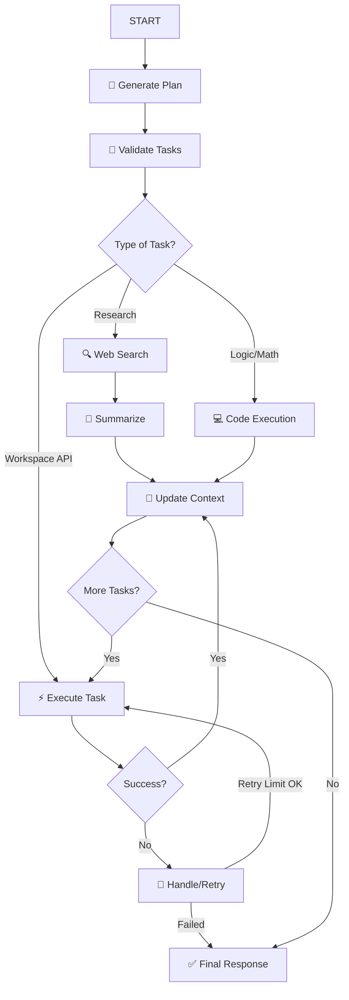

# Google Workspace Agent (v2.0)

A powerful, high-performance AI agent system for Google Workspace automation. Powered by a hybrid **LangChain** + **LangGraph** architecture, it transforms natural language requests into complex, multi-step workflows across Gmail, Drive, Sheets, and more.

## Architecture


### The LangGraph State Machine

The agent utilizes a directed acyclic graph (DAG) to orchestrate tasks. This approach enables conditional branching, sophisticated error recovery, and precise state management.



## Key Features

- **Hybrid Orchestration**: Uses LangChain for reasoning and LangGraph for reliable workflow state management.
- **Enhanced Workspace Support**: Seamlessly integrate with Gmail, Drive, Sheets, Calendar, Docs, Slides, and now **Google Meet** and **Google Chat**.
- **Sandboxed Python Runtime**: Safely execute complex logic, calculations, and data processing within a `RestrictedPython` environment.
- **Intelligent Research**: Built-in web search (DuckDuckGo/Tavily) with automatic LLM-powered summarization for external data enrichment.
- **Robust Reliability**: Exponential backoff and retry logic for high success rates against API rate limits and transient failures.
- **Dual Planning Modes**: High-precision LangChain reasoning with a zero-API-key heuristic fallback.

## Setup

1. **Install Dependencies**:
   ```bash
   pip install -r requirements.txt
   ```

2. **Configure Environment**:
   Run the interactive setup wizard to configure your LLM provider and API keys:
   ```bash
   python cli.py --setup
   ```

3. **Check .env**:
   Ensure your `.env` file contains the necessary configuration for OpenAI, OpenRouter, and optional search providers.

## Usage

### CLI Interace
```bash
python cli.py --task "List my Gmail messages about 'Invoice' and save to a new Sheet"
```

### Gradio Web UI
```bash
python gws_gradio.py
```

### Legacy Fallback (Zero LLM)
```bash
python cli.py --no-langchain --task "Search Drive for projects"
```

## Project Structure

- `src/gws_assistant/langchain_agent.py`: LangChain-powered planning engine.
- `src/gws_assistant/langgraph_workflow.py`: The StateGraph orchestration logic.
- `src/gws_assistant/tools/`: Extension tools for code execution and web search.
- `src/gws_assistant/execution.py`: Workspace task execution and context management.
- `src/gws_assistant/gws_runner.py`: Reliable subprocess wrapper for core binary execution.

## License

This project is licensed under the **MIT License**.
