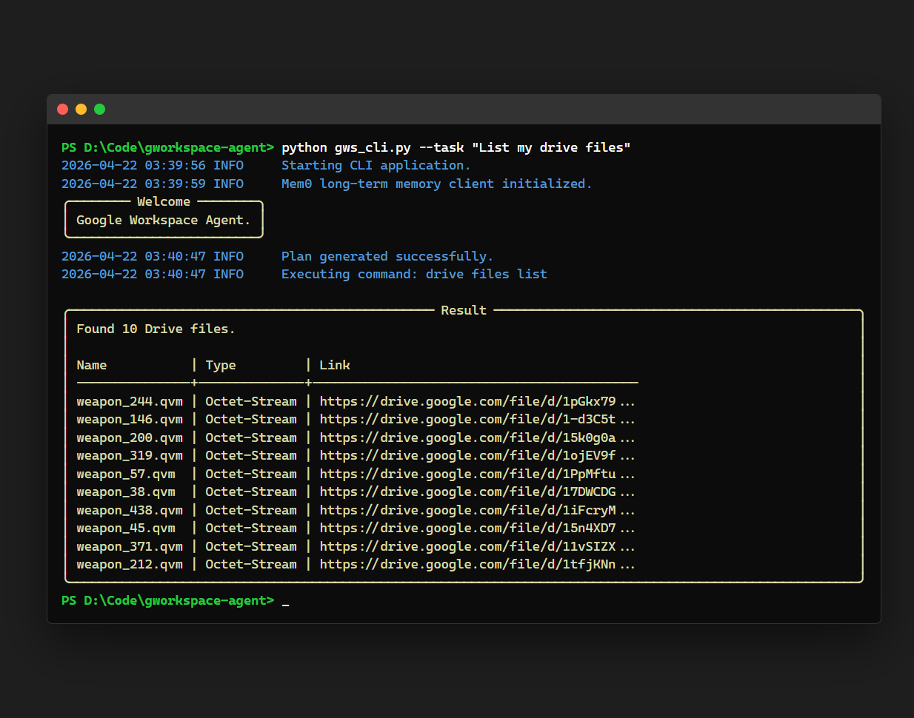
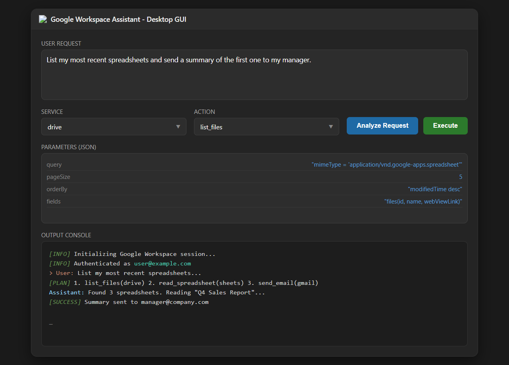
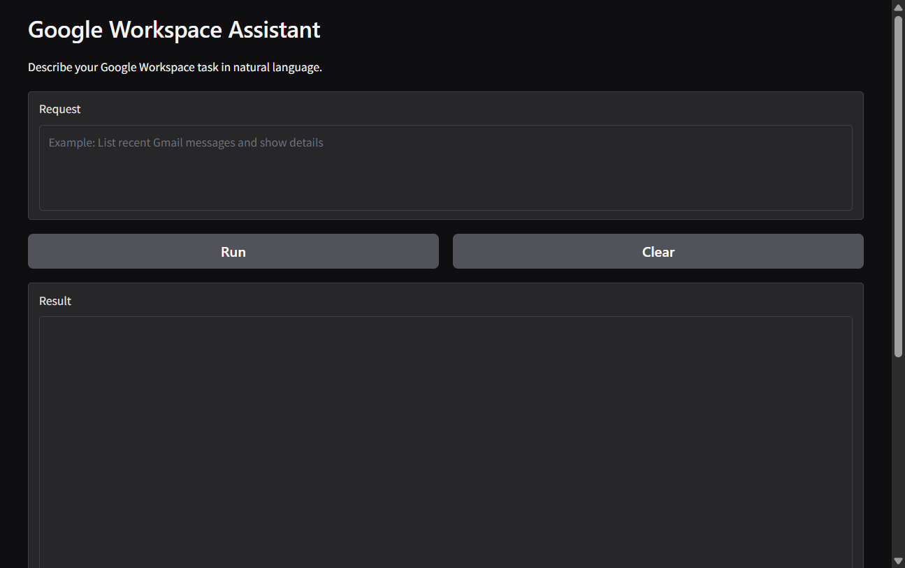
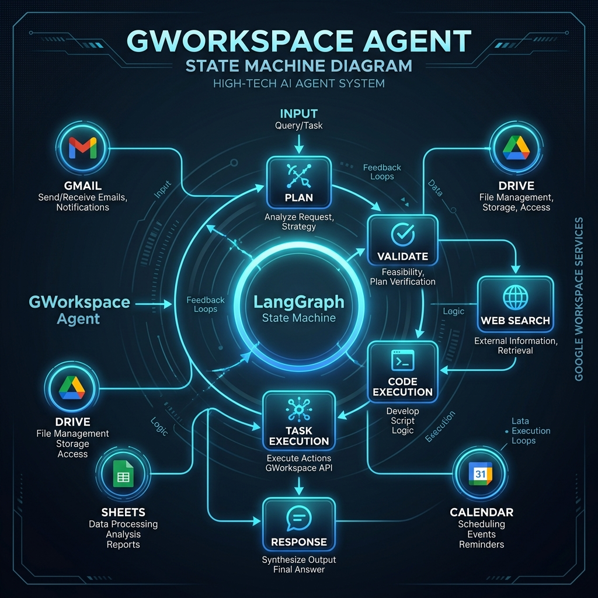
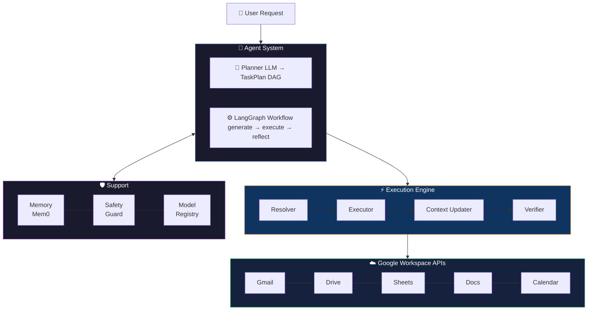
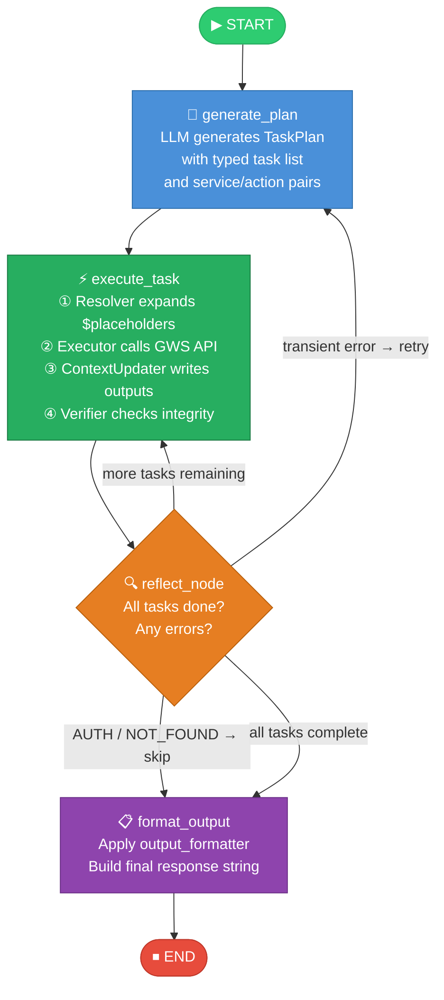
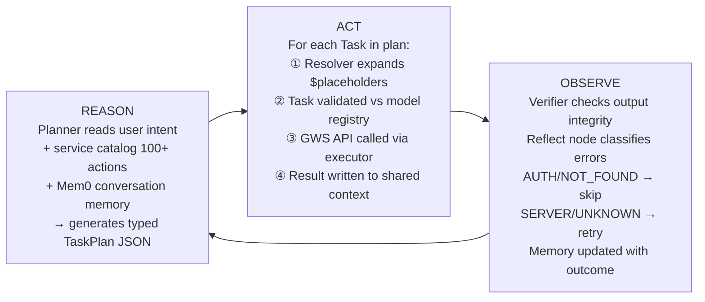
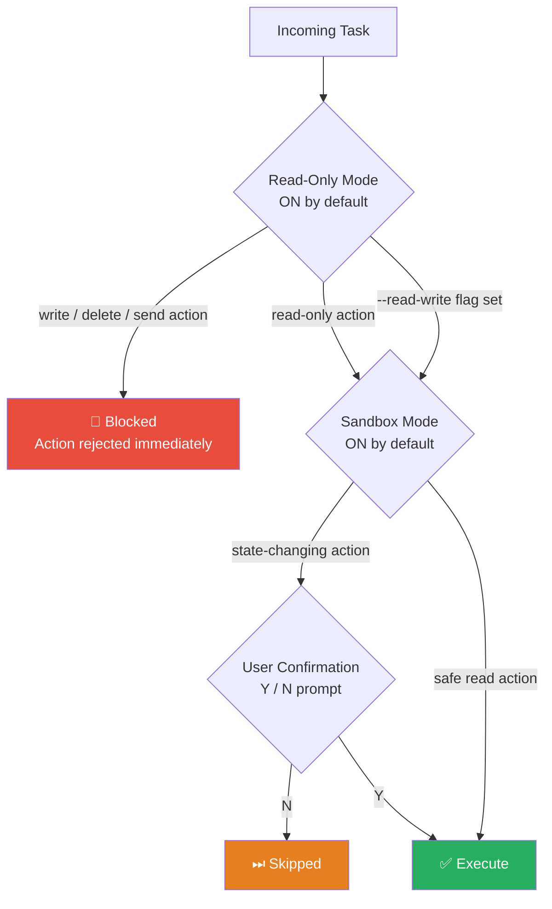

# 🚀 Google Workspace Agent

[](https://www.python.org/downloads/release/python-3119/)
[](https://opensource.org/licenses/MIT)
[](https://langchain-ai.github.io/langgraph/)
[](https://python.langchain.com/)
[](#safety--security)
[](https://pytest.org/)
[](https://github.com/haseeb-heaven/gworkspace-agent/actions/workflows/pipeline.yml)</br>
An autonomous AI agent for Google Workspace, built on a hybrid **LangChain ReAct + LangGraph DAG** architecture. It converts natural language into verified, multi-step workflows across Gmail, Drive, Sheets, Docs, Calendar, and 15+ other Google services — with built-in safety, memory, and sandboxed code execution.

---

## Table of Contents

- [Key Features](#key-features)
- [Demos](#demos)
- [Architecture](#architecture)
- [LangGraph DAG](#langgraph-dag)
- [ReAct Loop](#react-loop)
- [Supported Services](#supported-services)
- [Getting Started](#getting-started)
- [Interfaces](#interfaces)
- [Configuration](#configuration)
- [Safety & Security](#safety--security)
- [Testing](#testing)
- [Contributing](#contributing)

---

## Version
Latest: **v0.9.1**  
See [CHANGELOG.md](CHANGELOG.md) for full version history.

---

## Key Features

- **5-Step Verification Engine** - Strict, non-bypassable verification system with severity levels (CRITICAL, ERROR, WARNING) that validates parameters, permissions, results, data integrity, and idempotency
- **Hybrid ReAct + LangGraph Engine** — LLM-driven planner generates a typed DAG of tasks; LangGraph executes nodes with full state persistence and smart retry logic
- **Multi-Service Orchestration** — a single natural language request can chain Gmail, Drive, Sheets, Docs, Calendar, and Code execution in one plan
- **Long-Term Memory via Mem0** — agent learns from past interactions and recalls user preferences across sessions
- **Sandboxed Code Execution** — Python code runs inside a restricted E2B sandbox with stdout/stderr capture and exit code tracking
- **Safety-by-Default** — Read-Only mode blocks all writes; Sandbox mode requires manual confirmation before any state-changing action
- **Multi-Interface** — CLI, Desktop GUI, Web (Gradio), and Telegram Bot all share the same agent core
- **Model Agnostic** — works with any OpenAI-spec tool-calling model (Gemini, GPT-4o, Claude, Mistral, LLaMA) via OpenRouter or direct APIs
- **Verified Tool-Calling** — `model_registry.py` validates that the configured model supports function calling before any plan is generated

---

---

## 🎬 Demos & Showcases

### ⚡ Live Previews
The following animated showcases demonstrate the agent's autonomous planning and multi-service execution in real-time.

| Autonomous Workflow Demo | Multi-Interface Simulation |
| :---: | :---: |
|  |  |

> **Dynamic Multi-Mode Preview:** The simulation on the right is automatically generated and cycles through the CLI, Desktop, and Web interfaces.

### 🖼️ Interface Gallery
Detailed snapshots of the available user interfaces.

#### 💻 CLI (Typer + Rich)


#### 🖥️ Desktop GUI


#### 🌐 Web Interface (Gradio)


### Architecture Diagram


---

## Architecture

The agent uses a **three-layer architecture**: an LLM Planner that reasons about intent, a LangGraph Workflow that manages stateful execution, and a GWS Executor that calls real Google APIs.


---

## LangGraph DAG

The agent's execution graph is a **stateful directed acyclic graph** with four core nodes and conditional edges. Each node operates on a shared `AgentState` object that persists across the entire request lifecycle.



---

### AgentState Schema

python
class AgentState(TypedDict):
    user_request:   str            # original natural language query
    task_plan:      list[Task]     # planned task list generated by LLM
    context:        dict           # shared execution context (placeholders live here)
    task_results:   dict           # keyed outputs per task ID e.g. task-1, task-2
    current_index:  int            # execution cursor pointing to current task
    error:          str | None     # last error string for reflect_node classification
    retry_count:    int            # retry counter — capped per task to prevent loops
    final_output:   str            # formatted final response string


---

## ReAct Loop

Each task execution follows the **ReAct (Reason → Act → Observe)** pattern:



---

## Supported Services

The agent orchestrates **20+ Google services** and **100+ actions** via `service_catalog.py`:

| Service | Key Actions |
|---|---|
| 📧 **Gmail** | send, read, search, reply, forward, label, delete messages |
| 📂 **Drive** | list, upload, download, export, move, delete, share files and folders |
| 📊 **Sheets** | create, read, append, update, format spreadsheets |
| 📝 **Docs** | create, read, batch-update documents |
| 📅 **Calendar** | create, list, update, delete events with reminders |
| 📽️ **Slides** | create and read presentations |
| 👥 **Contacts** | list, search, create contacts |
| 💬 **Chat** | send messages to Google Chat spaces |
| 🐍 **Code** | execute Python in E2B sandbox, capture stdout/stderr/exit code |
| 🔍 **Web Search** | search and summarize web results |
| 🧠 **Memory** | store and retrieve user preferences via Mem0 |
| 🛡️ **Admin SDK** | manage users, groups, org units |
| 📜 **Apps Script** | run Google Apps Scripts |
| 🔐 **Model Armor** | content safety screening |
| 📋 **Tasks** | manage Google Tasks lists |
| 🗒️ **Keep** | create and read Google Keep notes |
| 📝 **Forms** | create and read Google Forms |
| 👥 **Meet** | create Meet links |
| 🏫 **Classroom** | manage courses and assignments |

---

## Getting Started

To get the agent running on your local machine, please follow the comprehensive **[Setup Guide (SETUP.md)](SETUP.md)**.

### Quick Start
1. **Clone & Install:**
   ```bash
   git clone https://github.com/haseeb-heaven/gworkspace-agent.git
   cd gworkspace-agent
   pip install -e .
   ```
2. **Configure Credentials:** Follow the [Google Cloud Setup](SETUP.md#%EF%B8%8F-step-3-google-cloud--credentials-setup) instructions.
3. **Run the Agent:**
   ```bash
   python gws_cli.py --task "List my drive files"
   ```

---

## Interfaces

| Interface | Command | Description |
|---|---|---|
| **💻 CLI** | `python gws_cli.py` | Rich terminal UI with streaming output, tables, and interactive prompts |
| **🖥️ Desktop GUI** | `python gws_gui.py` | Native app with visual task logs and manual controls |
| **🌐 Web UI** | `python gws_gui_web.py` | Gradio chat interface accessible from any browser |
| **🤖 Telegram Bot** | `python gws_telegram.py` | Secure mobile access via whitelisted Telegram Bot API |

---

## Configuration

All system configuration (API keys, security modes, and service endpoints) is managed via the `.env` file. 

> [!IMPORTANT]
> Detailed configuration steps and a full environment variable reference can be found in the **[Configuration Section of SETUP.md](SETUP.md#%EF%B8%8F-step-5-agent-configuration)**.

---

## Safety & Security



- **Read-Only Mode** — default ON. Enable writes with `--read-write` or `READ_ONLY_MODE=false`
- **Sandbox Mode** — default ON. Disable with `--no-sandbox` or `SANDBOX_ENABLED=false`
- **Email Recipient Lock** — `DEFAULT_RECIPIENT_EMAIL` forces all outbound emails to one address regardless of what the LLM generates
- **Model Registry** — raises `ValueError` at startup if the configured model is not on the tool-calling allowlist in `model_registry.py`

---

## Testing

```bash
# Full test suite
python -m pytest
```

```bash
# Drive metadata and placeholder contract tests only
python -m pytest -m "drive" -v
```

```bash
# With coverage report
python -m pytest --cov=gws_assistant --cov-report=term-missing
```

```bash
# Integration tests (requires live Google credentials)
python -m pytest -m "not skip_integration" -v
```

| Test File | Coverage |
|---|---|
| `tests/test_placeholder_contracts.py` | Canonical and legacy placeholder resolution |
| `tests/test_drive_metadata.py` | Drive file summarizer helper |
| `tests/test_resolver.py` | Full resolver logic including LEGACY_MAP |

---

## Contributing

1. Fork the repository
2. Branch from `develop`: `git checkout -b feature/your-feature develop`
3. Make changes with tests
4. Ensure all tests pass: `python -m pytest`
5. Open a Pull Request targeting **`develop`** — never target `master` directly

---

## License

Distributed under the **MIT License**. See [`LICENSE`](LICENSE) for details.

---

> **Note:** This project was **architected and designed** by **Haseeb Mir**.
> AI tools (GitHub Copilot, Jules) were used to assist with **implementation**,
> **boilerplate generation**, and **refactoring** — all **features**, **architecture**
> **decisions**, and **system design** are **original**.

<p align="center">
  Built with ❤️ by <a href="https://github.com/haseeb-heaven">Haseeb Mir</a>
</p>
