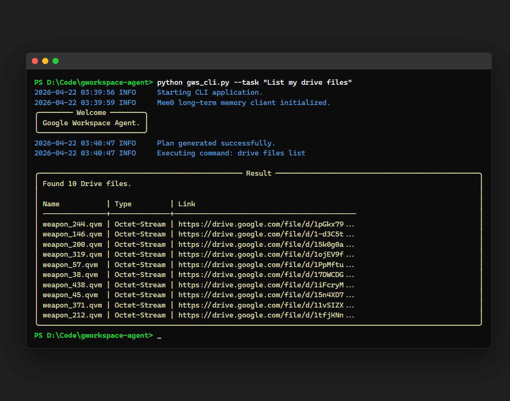
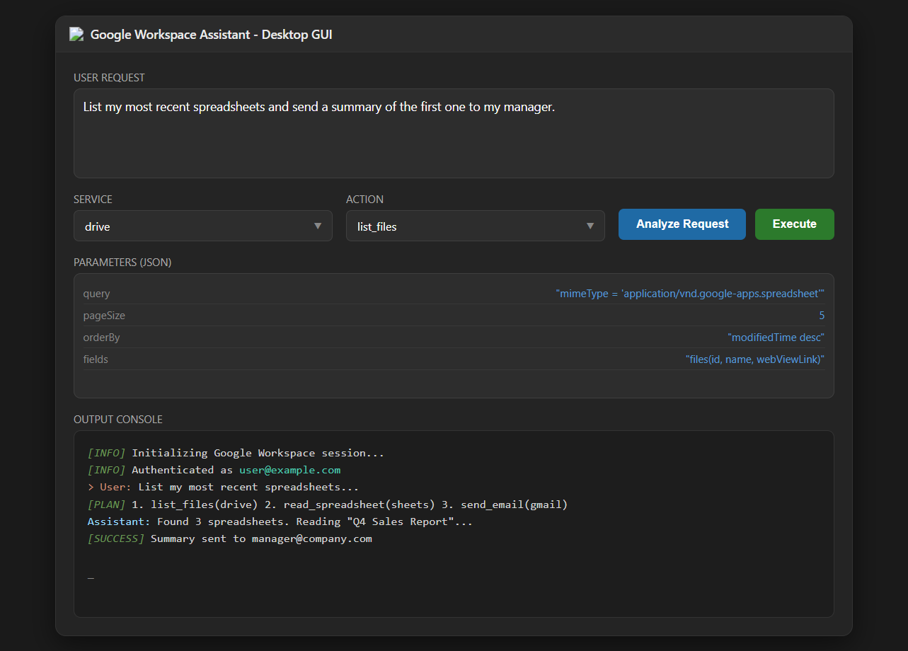
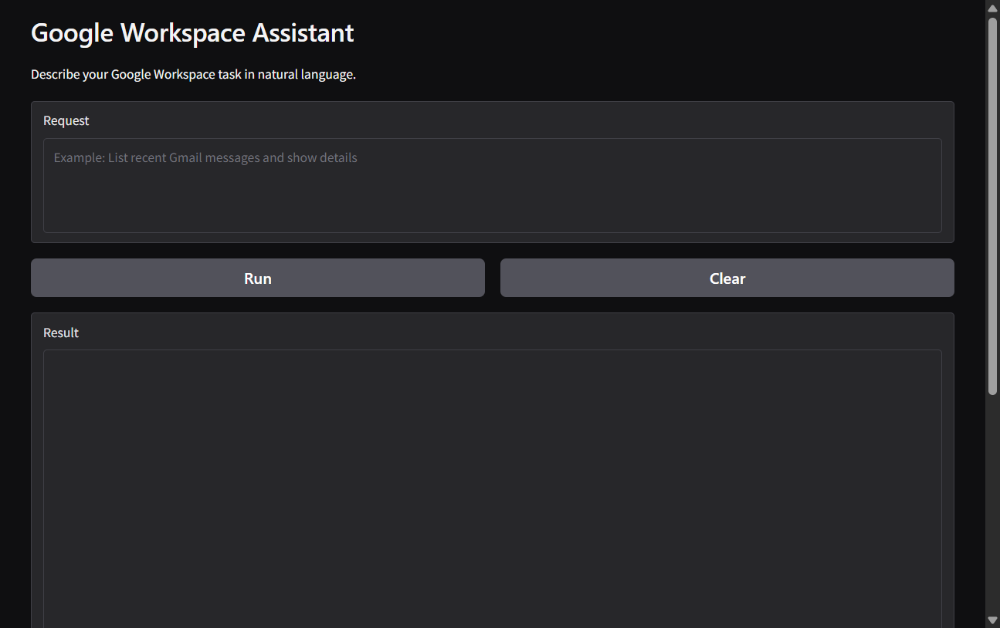
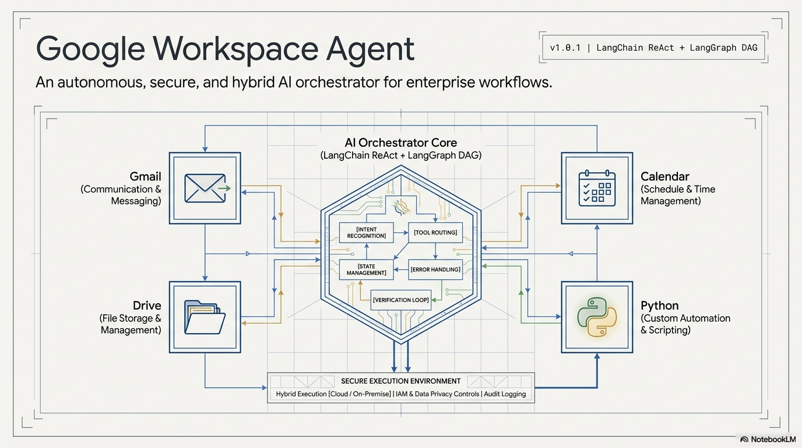
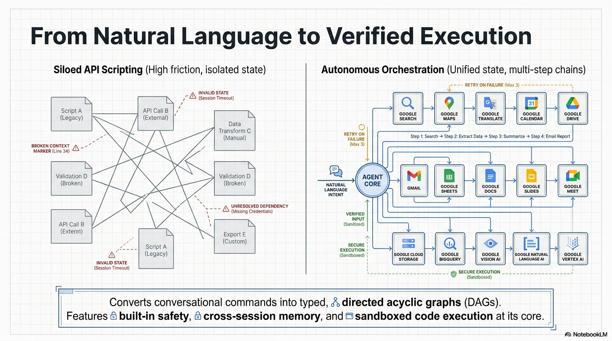
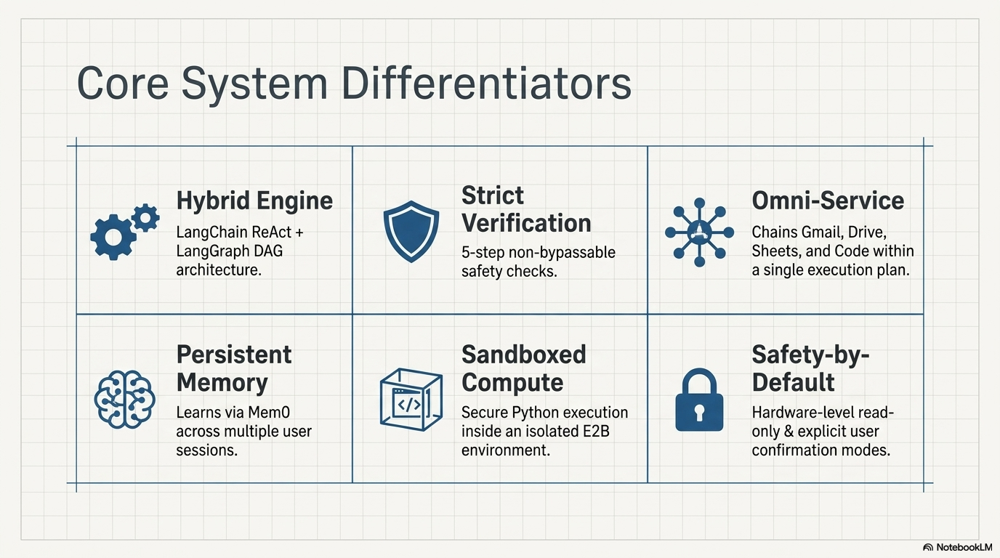
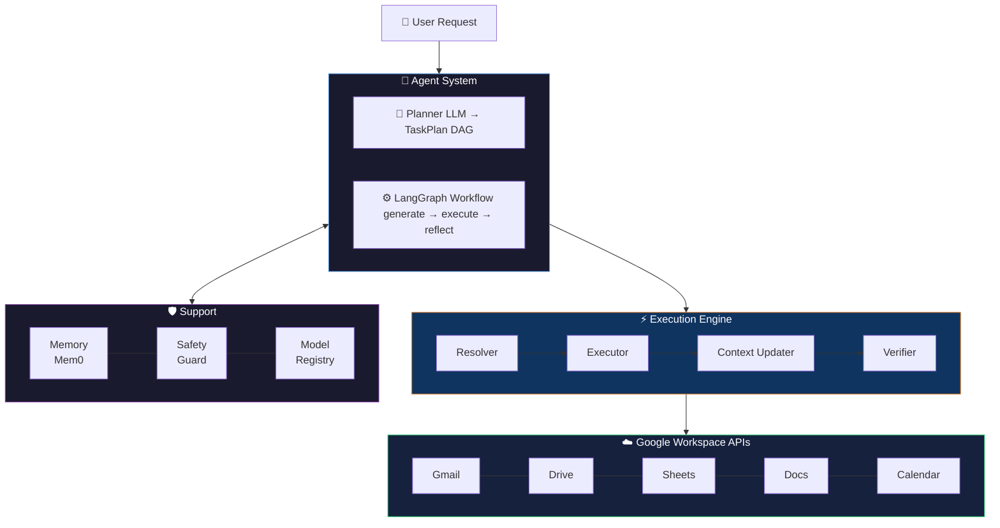
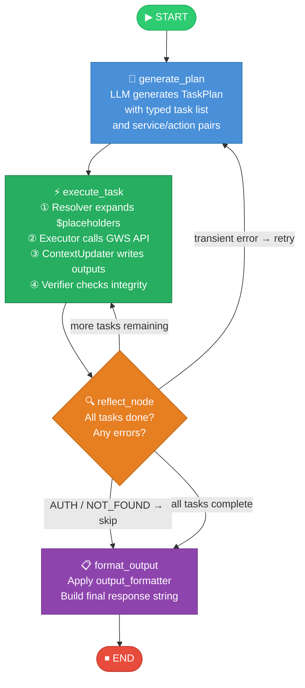
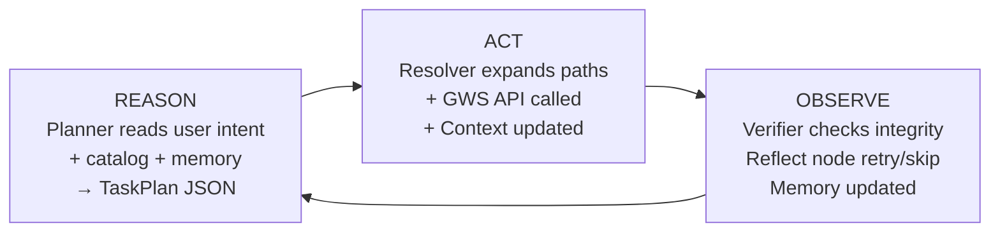
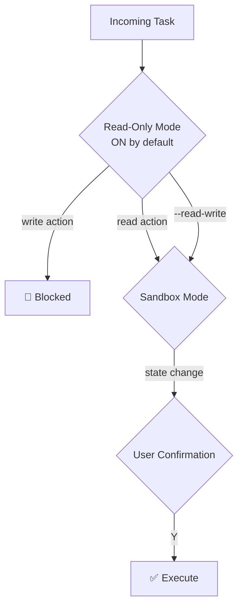

# 🚀 Google Workspace Agent

[](https://www.python.org/downloads/release/python-3119/)
[](https://opensource.org/licenses/MIT)
[](https://langchain-ai.github.io/langgraph/)
[](https://python.langchain.com/)
[](#safety--security)
[](https://pytest.org/)
[](https://github.com/haseeb-heaven/gworkspace-agent/actions/workflows/pipeline.yml)</br>

An autonomous AI agent for Google Workspace, built on a hybrid **LangChain ReAct + LangGraph DAG** architecture. It converts natural language into verified, multi-step workflows across Gmail, Drive, Sheets, Docs, Calendar, and 19+ other Google services — with built-in safety, memory, and sandboxed code execution.

---

## 📌 Navigation & Status

| Section | Description | Version |
| :--- | :--- | :--- |
| [🚀 Quick Start](#-getting-started) | Get up and running in minutes | **Current: v1.0.2** |
| [🎬 Demos](#-demos--showcases) | Visual previews and galleries | [Changelog](CHANGELOG.md) |
| [⚙️ Architecture](#️-architecture) | System design and execution flow | [Statistics](STATS.md) |
| [🛡️ Safety](#️-safety--security) | Security protocols and read-only mode | [Issues](ISSUES.md) |

---

## 🌟 Key Features

- **5-Step Verification Engine** - Strict, non-bypassable verification system that validates parameters, permissions, results, data integrity, and idempotency.
- **Hybrid ReAct + LangGraph Engine** — LLM-driven planner generates a typed DAG of tasks; LangGraph executes nodes with full state persistence.
- **Model Registry & Fallbacks** — Managed model configurations with automatic fallback chains across OpenAI, Anthropic, and OpenRouter.
- **Multi-Service Orchestration** — Chain Gmail, Drive, Sheets, Docs, Calendar, and Code execution in a single request.
- **Long-Term Memory** — Powered by Mem0 to recall user preferences across sessions.
- **Sandboxed Code Execution** — Python code runs inside a restricted E2B sandbox.
- **Safety-by-Default** — Read-Only mode and manual confirmation for state-changing actions.
- **Portable Binary CLI** — Pre-built executables (`gws_cli` / `gws_cli.bat`) for easy deployment without complex Python environments.
- **Multi-Interface** — CLI, Desktop GUI, Web (Gradio), and Telegram Bot support.

---

## 🎬 Demos & Showcases

### 🎥 Featured Demo
Watch the Google Workspace Agent in action, performing multi-service orchestration across Gmail, Drive, and Sheets.

https://github.com/user-attachments/assets/951c7620-29ae-4f41-8792-7bf92f6c0069

### ⚡ Interactive Previews
High-level animated showcases of the agent's autonomous planning.

#### 🧠 Autonomous Workflow Demo


#### 🔄 Multi-Interface Simulation


---

### 🖼️ Visual Gallery
Snapshots of the diverse user interfaces supported by the agent.

<p align="center">
  
  <br><i>CLI Interface (Typer + Rich)</i><br><br>
  
  <br><i>Desktop GUI (Tkinter)</i><br><br>
  
  <br><i>Web Interface (Gradio)</i><br><br>
</p>

---

### 📊 Project Presentation
For a detailed overview of the system design, features, and roadmap, you can view the primary slides below:

<p align="center">
  
  <br><i>Slide 1: Project Introduction</i><br><br>
  
  <br><i>Slide 2: System Overview</i><br><br>
  
  <br><i>Slide 3: Core Architecture</i><br><br>
</p>

[**🚀 View Full 13-Slide Walkthrough**](PRESENTATION.md) | [**📥 Download PPTX**](assets/Google_Workspace_Agent.pptx)

---

## ⚙️ Architecture

### 📐 System Design
The agent uses a **three-layer architecture**: an LLM Planner, a LangGraph Workflow state manager, and a GWS Executor for API calls.


```mermaid
flowchart TD
    USER["👤 User Request"] --> AGENT

    subgraph AGENT["🤖 Agent System"]
        PL["🧠 Planner LLM → TaskPlan DAG"]
        WF["⚙️ LangGraph Workflow generate → execute → reflect"]
    end

    AGENT --> EX

    subgraph EX["⚡ Execution Engine"]
        direction LR
        RS["Resolver"] --> EXC["Executor"] --> CU["Context Updater"] --> VF["Verifier"]
    end

    EX --> APIS

    subgraph APIS["☁️ Google Workspace APIs"]
        direction LR
        GM["Gmail"] --- DR["Drive"] --- SH["Sheets"] --- DC["Docs"] --- CA["Calendar"]
    end

    AGENT <--> SUP

    subgraph SUP["🛡️ Support"]
        direction LR
        MEM["Memory\nMem0"] --- SG["Safety\nGuard"] --- MR["Model\nRegistry"]
    end

    style AGENT fill:#1a1a2e,color:#fff,stroke:#4A90D9
    style EX fill:#0f3460,color:#fff,stroke:#E67E22
    style APIS fill:#16213e,color:#fff,stroke:#2ECC71
    style SUP fill:#1a1a2e,color:#fff,stroke:#8E44AD
```


---

### 📉 LangGraph Execution DAG
Stateful directed acyclic graph managing the execution lifecycle.


```mermaid
flowchart TD
    START(["▶ START"]) --> GP

    GP["🧠 generate_plan\nLLM generates TaskPlan\nwith typed task list\nand service/action pairs"]

    GP --> ET

    ET["⚡ execute_task\n① Resolver expands $placeholders\n② Executor calls GWS API\n③ ContextUpdater writes outputs\n④ Verifier checks integrity"]

    ET --> RN

    RN{"🔍 reflect_node\nAll tasks done?\nAny errors?"}

    RN -->|"more tasks remaining"| ET
    RN -->|"transient error → retry"| GP
    RN -->|"AUTH / NOT_FOUND → skip"| FO
    RN -->|"all tasks complete"| FO

    FO["📋 format_output\nApply output_formatter\nBuild final response string"]

    FO --> END(["⏹ END"])

    style GP fill:#4A90D9,color:#fff,stroke:#2c6fad
    style ET fill:#27AE60,color:#fff,stroke:#1a7a43
    style RN fill:#E67E22,color:#fff,stroke:#b85e0a
    style FO fill:#8E44AD,color:#fff,stroke:#6b2f87
    style START fill:#2ECC71,color:#fff,stroke:#27ae60
    style END fill:#E74C3C,color:#fff,stroke:#c0392b
```

---

### 🔄 ReAct Loop
Each task execution follows the **Reason → Act → Observe** pattern.


```mermaid
flowchart LR
    R["REASON<br>Planner reads user intent<br>+ catalog + memory<br>→ TaskPlan JSON"]
    A["ACT<br>Resolver expands paths<br>+ GWS API called<br>+ Context updated"]
    O["OBSERVE<br>Verifier checks integrity<br>Reflect node retry/skip<br>Memory updated"]

    R --> A --> O --> R
```

---

## 🔌 Supported Services

The agent orchestrates **20+ Google services** and **100+ actions**:

| Category | Services |
| :--- | :--- |
| **Communication** | 📧 Gmail, 💬 Chat, 👥 Contacts, 📽️ Meet |
| **Storage & Docs** | 📂 Drive, 📊 Sheets, 📝 Docs, 📽️ Slides, 📋 Tasks, 🗒️ Keep |
| **Automation** | 🐍 Python Sandbox, 📜 Apps Script, 🔍 Web Search |
| **Management** | 🛡️ Admin SDK, 📝 Forms, 🏫 Classroom, 🔐 Model Armor |

---

## 🚀 Getting Started

Follow the **[Detailed Setup Guide (SETUP.md)](SETUP.md)** for credentials and environment configuration.

### Quick Install
```bash
git clone https://github.com/haseeb-heaven/gworkspace-agent.git
cd gworkspace-agent
pip install -e .
```

### Run the Agent
```bash
# Start a task via CLI
gws_cli --task "List my drive files"
```

---

## 💻 Usage & Workflows

### Examples
Here are high-impact, realistic examples that showcase the full power of your agent — multi-service chaining, NLP complexity, and things no standard CLI can do:

***

### 📧 Gmail Workflows
```bash
gws_cli --task "Find all emails from my boss this week, mark them as read, and reply to any that have a question mark in the subject"
```
```bash
gws_cli --task "Search for all invoices received in April, download their attachments to Drive folder 'Invoices/April', and create a Sheets log with sender, date, and amount"
```

***

### 📅 Calendar Workflows
```bash
gws_cli --task "List all my meetings tomorrow, create a Google Doc agenda for each one with the title and attendees, and send the doc link to all attendees via email"
```
```bash
gws_cli --task "Find all meetings I have next week that are longer than 1 hour and add a 15-minute prep reminder before each one"
```

***

### 📂 Drive + Docs Workflows
```bash
gws_cli --task "Find all Google Docs modified in the last 7 days, create a summary of each, and compile everything into a single 'Weekly Report' Doc"
```
```bash
gws_cli --task "Search Drive for files shared with me that I haven't opened in 30 days and list them in a Sheets file called 'Stale Shares'"
```

***

### 📊 Sheets Workflows
```bash
gws_cli --task "Open the spreadsheet 'Sales Q1', calculate total revenue per region, and email a summary report to the sales team"
```
```bash
gws_cli --task "Read the 'Team Tasks' sheet, find all rows where status is 'overdue', and send a reminder email to the person in the assignee column"
```

***

### 🔗 Complex Multi-Service Chains
```bash
gws_cli --task "Read my unread emails, extract all action items mentioned, add them as Google Tasks, create a Calendar block tomorrow morning called 'Action Items Review', and send me a summary on Telegram"
```
```bash
gws_cli --task "Get all attendees from my 'Quarterly Review' calendar event, create a shared Google Doc called 'Q2 Review Notes', and send each attendee an email with the doc link"
```

***

### 🐍 Code Execution (E2B Sandbox)
```bash
gws_cli --task "Download the 'Revenue.csv' file from my Drive, run a Python script to calculate month-over-month growth, and write the results back to a new sheet called 'Growth Analysis'"
```
```bash
gws_cli --task "Read the JSON config file from Drive folder 'Configs', validate it with Python, and email me the validation errors if any are found"
```

---

## 🛡️ Safety & Security


```mermaid
flowchart TD
    REQ["Incoming Task"] --> RO{"Read-Only Mode\nON by default"}
    RO -->|"write action"| BLOCK["🚫 Blocked"]
    RO -->|"read action"| SB{"Sandbox Mode"}
    SB -->|"state change"| CONF{"User Confirmation"}
    CONF -->|"Y"| EXEC["✅ Execute"]
    RO -->|"--read-write"| SB
```

- **Read-Only Mode**: Default ON to prevent accidental data modification.
- **Sandbox Mode**: Executes Python code in an isolated environment.
- **Recipient Lock**: `DEFAULT_RECIPIENT_EMAIL` forces all emails to a safe address.

---

## 🧪 Quality Assurance

```bash
# Run unit tests
python -m pytest

# Run with coverage
python -m pytest --cov=gws_assistant
```

| Test Type | Directory / File | Description |
| :--- | :--- | :--- |
| **🧪 Unit Tests** | `tests/test_unit_*.py` | Fully mocked tests for individual components. No GWS binary or credentials required. |
| **⚙️ Integration** | `tests/test_integration.py` | Validates the LangGraph state machine with mocked GWS tools. |
| **⚡ Live Integration** | `tests/test_live_integration.py` | End-to-end tests using real Google Workspace credentials and the GWS binary. |
| **🛡️ Hardening** | `tests/test_hardening_*.py` | Security and safety policy verification (Regex ReDoS, Sandbox isolation). |
| **🛠️ Manual** | `tests/manual/` | One-off scripts for manual feature verification and debugging. |

---

## License

Distributed under the **MIT License**. See [`LICENSE`](LICENSE) for details.

---

## Star History

<a href="https://www.star-history.com/?repos=haseeb-heaven%2Fgworkspace-agent&type=date&legend=top-left">
 <picture>
   <source media="(prefers-color-scheme: dark)" srcset="https://api.star-history.com/chart?repos=haseeb-heaven/gworkspace-agent&type=date&theme=dark&legend=top-left" />
   <source media="(prefers-color-scheme: light)" srcset="https://api.star-history.com/chart?repos=haseeb-heaven/gworkspace-agent&type=date&legend=top-left" />
   
 </picture>
</a>

---

> **Note:** This project was **architected and designed** by **Haseeb Mir**.
> AI tools (GitHub Copilot, Jules) were used to assist with **implementation**,
> **boilerplate generation**, and **refactoring** — all **features**, **architecture**
> **decisions**, and **system design** are **original**.

<p align="center">
  
  <br>
  <b>Developed by <a href="https://github.com/haseeb-heaven">Haseeb Mir</a></b>
</p>
